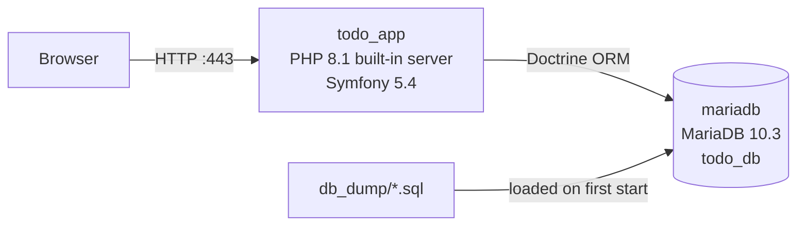
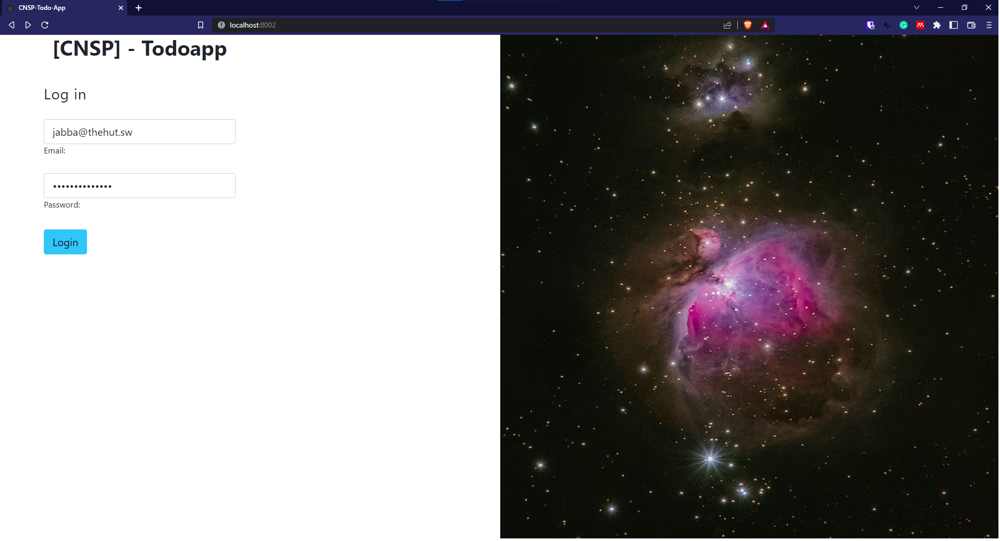
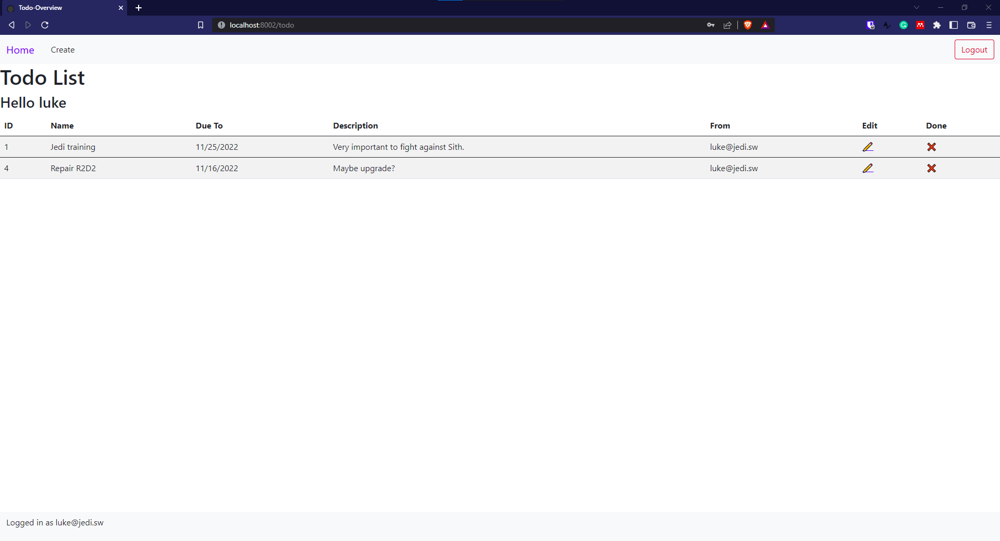
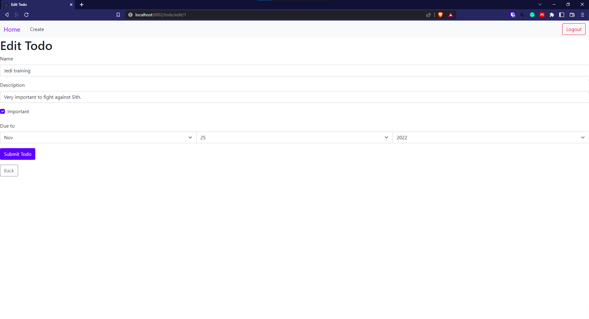
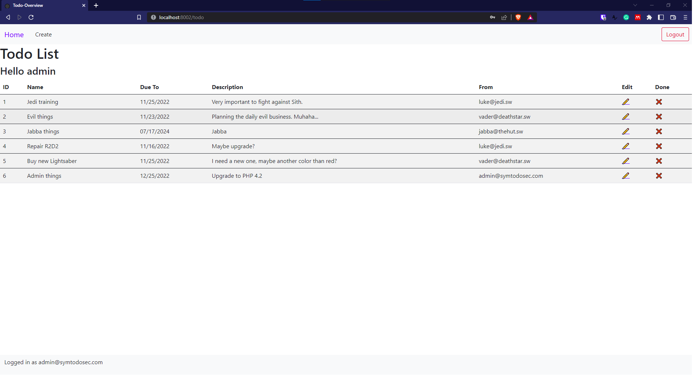

<div align="center">

# CNSP Symfony Todo App

**A small todo app that demonstrates login, CSRF protection and per-user access control in Symfony**


[Quick start](#quick-start) · [Demo accounts](#demo-accounts) · [Security](docs/security.md) · [Documentation](#documentation)

</div>

Challenge task for the course *Computer Network Security Principles* (CNSP) at the University of Zurich, fall 2022.
Users log in and manage their own todos. An admin sees and edits all todos.

## Features

- 🔐 Form login against users stored in MariaDB, passwords hashed with bcrypt
- 🛡️ CSRF token on the login form and on all todo forms
- 👤 Each user sees and edits only their own todos; other todos return 404
- 👑 Admin role (`ROLE_ADMIN`) with access to all todos
- 📝 Create and edit todos with name, description, due date, importance and done flag

> [!NOTE]
> Built in November 2022 for a course assignment. The dependencies are pinned to that time (Symfony 5.4, PHP 8.1,
> MariaDB 10.3) and the project is not developed further. It runs in the Symfony `dev` environment and is not meant
> for production.

## Contents

- [Tech stack](#tech-stack)
- [Architecture](#architecture)
- [Repository structure](#repository-structure)
- [Quick start](#quick-start)
- [Demo accounts](#demo-accounts)
- [Services and ports](#services-and-ports)
- [Configuration](#configuration)
- [Data](#data)
- [Development](#development)
- [Documentation](#documentation)
- [Known issues](#known-issues)
- [Screenshots](#screenshots)
- [Acknowledgements](#acknowledgements)
- [License](#license)
- [Author](#author)

## Tech stack

| Area | Technology |
|---|---|
| Backend |     |
| Frontend |  (loaded from the jsDelivr CDN) |
| Database |  |
| Infrastructure |   |

## Architecture



| Part | Where |
|---|---|
| Routes and request handling | [`todo_app/src/Controller/`](todo_app/src/Controller/) |
| Entities `User` and `Todo` | [`todo_app/src/Entity/`](todo_app/src/Entity/) |
| Todo form | [`todo_app/src/Form/TodoType.php`](todo_app/src/Form/TodoType.php) |
| Login, firewall, access rules | [`todo_app/config/packages/security.yaml`](todo_app/config/packages/security.yaml) |
| Templates | [`todo_app/templates/`](todo_app/templates/) |

## Repository structure

| Path | Content |
|---|---|
| [`docker-compose.yaml`](docker-compose.yaml) | App and database services |
| [`.env.example`](.env.example) | Template for the local `.env` with ports and passwords |
| [`db_dump/`](db_dump/) | Schema and demo data, loaded into MariaDB on the first start |
| [`todo_app/`](todo_app/) | Symfony application and its [`Dockerfile`](todo_app/Dockerfile) |
| [`docs/`](docs/) | Documentation and screenshots |

## Quick start

Requirements: [Docker](https://docs.docker.com/get-docker/) with Docker Compose. PHP and Composer are not needed on
the host.

1. Clone the repository:

   ```bash
   git clone https://github.com/HuberNicolas/network-security-uzh.git
   ```

   ```bash
   cd network-security-uzh
   ```

2. Create the local `.env` and replace the placeholders with your own values:

   ```bash
   cp .env.example .env
   ```

3. Build and start the containers:

   ```bash
   docker compose up --build
   ```

   On the first start, the app container installs the PHP dependencies from `composer.lock` (takes about a minute) and
   MariaDB loads the demo data from `db_dump/`.

4. Open <http://localhost:443/> and log in with one of the [demo accounts](#demo-accounts). The app uses plain HTTP on
   port 443, not HTTPS.

To start again with the original demo data, remove the database volume:

```bash
docker compose down -v
```

## Demo accounts

All accounts are fictional and exist only in the demo data.

| User | Email | Password | Role |
|---|---|---|---|
| admin | `admin@symtodosec.com` | `NhnfR6ai1r9EkRoJ` | `ROLE_ADMIN` |
| luke | `luke@jedi.sw` | `QA9ha+CAMkRc&g5e` | `ROLE_USER` |
| vader | `vader@deathstar.sw` | `t?n%#zrd2XGXfPe6` | `ROLE_USER` |
| jabba | `jabba@thehut.sw` | `password123456` | `ROLE_USER` (dummy account with a weak password) |

The admin password was reset in 2026 because the original one was lost.

## Services and ports

| Service | Image | Host port | Container port |
|---|---|---|---|
| `todo_app` | built from [`todo_app/Dockerfile`](todo_app/Dockerfile) (`php:8.1-cli-alpine`) | `APP_PORT` (443) | 8000 |
| `mariadb` | `mariadb:10.3` | `DB_PORT` (3906) | 3306 |

## Configuration

Docker Compose reads these variables from `.env` in the repository root.

| Variable | Default in `.env.example` | Meaning |
|---|---|---|
| `APP_PORT` | `443` | Host port of the web app |
| `DB_PORT` | `3906` | Host port of MariaDB |
| `APP_SECRET` | placeholder | Symfony secret, any random string |
| `MARIADB_DATABASE` | `todo_db` | Database name; the dumps expect `todo_db` |
| `MARIADB_USER` | `tduser` | Database user of the app |
| `MARIADB_PASSWORD` | placeholder | Password of `MARIADB_USER` |
| `MARIADB_ROOT_PASSWORD` | placeholder | MariaDB root password |

Compose builds `DATABASE_URL` for Symfony from these values. The database variables only take effect when the
database volume is created; after changing them, run `docker compose down -v`.

## Data

[`db_dump/user.sql`](db_dump/user.sql) and [`db_dump/todo.sql`](db_dump/todo.sql) contain the schema and fictional
demo data (Star Wars characters) written for this project. See [docs/database.md](docs/database.md).

## Development

| Task | Command |
|---|---|
| Open a shell in the app container | `docker compose exec todo_app sh` |
| Run a Symfony console command | `docker compose exec todo_app php bin/console <command>` |
| Hash a new password | `docker compose exec todo_app php bin/console security:hash-password` |
| Open a MariaDB shell | `docker compose exec mariadb mysql -u root -p todo_db` |
| Symfony profiler | <http://localhost:443/_profiler> |

## Documentation

| Guide | Content |
|---|---|
| [docs/security.md](docs/security.md) | Authentication, CSRF protection and access control |
| [docs/database.md](docs/database.md) | Schema, demo data and how to reset or export it |

## Known issues

- The Doctrine migrations in [`todo_app/migrations/`](todo_app/migrations/) do not match the dumps (they drop tables
  `todo_old` and `user_old`). The schema comes from `db_dump/`; do not run `doctrine:migrations:migrate`.
- `/` shows the login form also for users who are already logged in. Use **Home** or `/todo` to get to the list.
- There is no way to delete a todo.
- The login page loads its background image from Unsplash and Bootstrap from jsDelivr, so it needs internet access to
  look right.

## Screenshots

| Login | Todo list (user) |
|---|---|
|  |  |
| **Edit form** | **Todo list (admin)** |
|  |  |

The screenshots are from 2022, when the app ran on port 8002.

## Acknowledgements

- [Bootstrap](https://getbootstrap.com/) (MIT License), loaded from jsDelivr
- Background image of the login page: a photo from [Unsplash](https://unsplash.com/), used under the
  [Unsplash License](https://unsplash.com/license); it is not part of this repository
- Commit `543a855` by [AnIv-UZH](https://github.com/AnIv-UZH) (port change in the README)

## License

The code is licensed under the [MIT License](LICENSE). Bootstrap and the Unsplash image keep their own licenses.

## Author

Nicolas Huber, challenge task for *Computer Network Security Principles*, University of Zurich, fall 2022.
